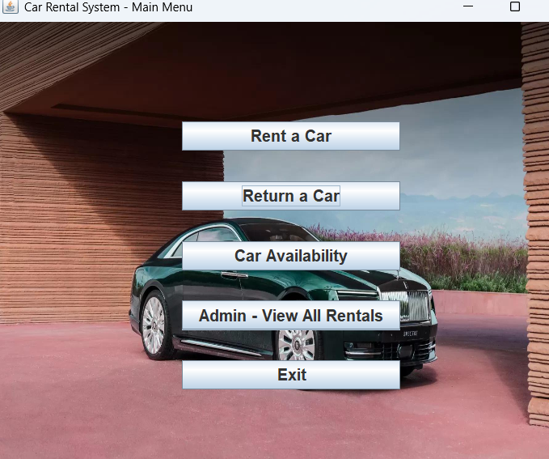
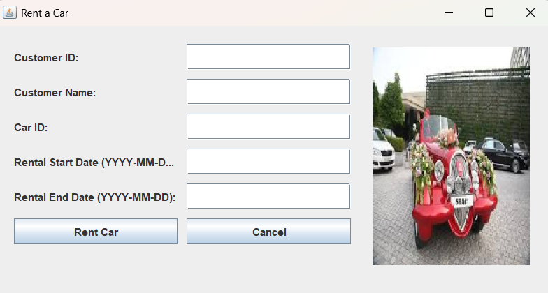
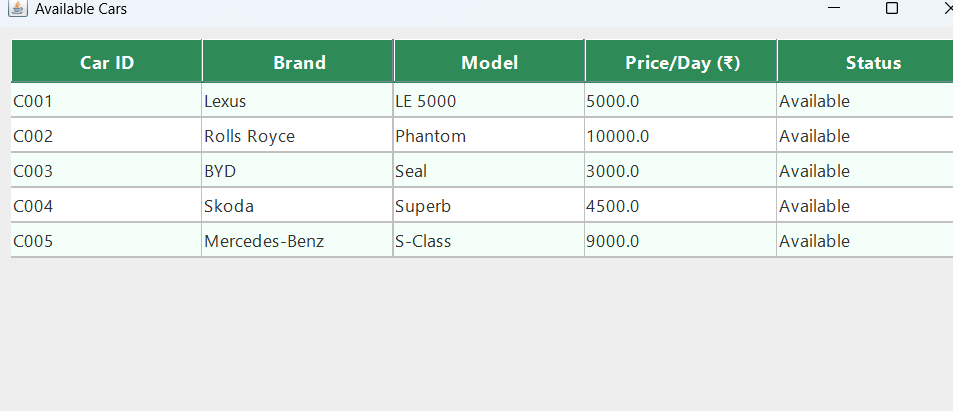
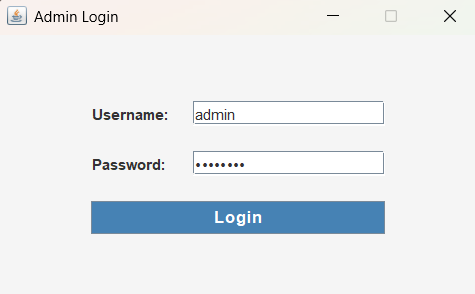
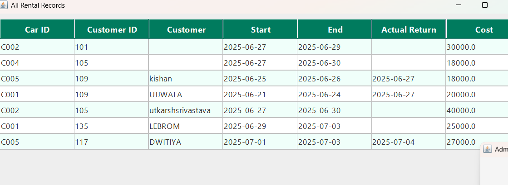

# 🚗 Car Rental Management System (Java+OOPS+MySQL+SWING)

A powerful desktop-based Car Rental Management System built using Java Swing, MySQL, and Object-Oriented Programming (OOP) principles. This project features an intuitive GUI, secure admin login, real-time car availability, rental receipt generation, late return penalty calculation, and a clean modular backend structure powered by Java OOPs.

## 📌 Features

✔️ **Modern GUI Interface**  
User-friendly and visually styled interface built using Java Swing for smooth navigation and experience.

✔️ **Object-Oriented Backend**  
Follows clean Java OOP principles for modularity and code reuse across the system (Classes: `Car`, `Customer`, `Rental`, etc.).

✔️ **Car Renting System**  
Allows users to rent available cars by entering rental details and automatically calculates total cost and rental days.

✔️ **Return with Penalty Calculation**  
Automatically calculates penalties for late returns based on the expected return date.

✔️ **Admin Login System**  
Secure login interface for administrators to view all rentals and customer activity.

✔️ **Car Availability Panel**  
Shows real-time availability of cars in an organized tabular format.

✔️ **Rental History Viewer (Admin Panel)**  
View all current and past rentals including customer details, dates, cost, and return status.

✔️ **Search by Car or Customer**  
(Planned/Optional) Feature to quickly search rentals by car ID or customer ID.

✔️ **Rental Receipt Generator**  
Generates a `.txt` receipt file for each rental with key details and saves it locally.

✔️ **MySQL Database Integration**  
Stores car, customer, and rental information persistently using MySQL with foreign key relations.

✔️ **Data Validation & Error Handling**  
Proper checks for empty fields, invalid dates, and database errors to ensure smooth functionality.

# 🧱 Project Structure

CarRentalSystem/
├── carrentalsystem/
│ ├── MainMenu.java # Main GUI with buttons to access all modules
│ ├── RentCarGUI.java # UI for renting a car
│ ├── ReturnCarGUI.java # UI for returning a car and penalty check
│ ├── CarAvailabilityGUI.java # GUI to display available cars
│ ├── AllRentalsGUI.java # Admin panel to view all rental history
│ ├── AdminLoginGUI.java # Login interface for admin access
│ ├── CarRentalSystem.java # Core backend class for car operations and DB logic
│ ├── Customer.java # Customer object (encapsulates customerId, name, etc.)
│ ├── Car.java # Car object representing cars in the system
│ ├── Rental.java # Rental class for rental logic and record keeping
│ └── DBConnection.java # Manages the database connection (optional split)
│
├── resources/
│ ├── fantom.jpg # Background image used in MainMenu
│ ├── luxuy.jpeg # Car image for RentCarGUI
│ └── logo.png # (Optional) Logo used in login or headers
│
├── database/
│ ├── schema.sql # SQL script to create and populate MySQL tables
│
├── receipt_<customerId>.txt # Auto-generated text receipts for each rental
│
├── README.md # Project documentation

   # # ✨ Highlights:
   
- **Separation of Concerns:** Each GUI has its own class for better readability and scalability.
- **Modular Design:** Core business logic resides in `CarRentalSystem.java`, keeping the UI classes clean.
- **Resource Folder:** Stores background images and car assets used across the application.
- **Extensible:** Easy to add new features like search, reporting, or customer dashboard by following the same structure.

## 📸 Screenshots

Below are some key interfaces from the Car Rental Management System:

### 🏠 Main Menu

> Intuitive interface to navigate between core modules – Rent, Return, Availability, and Admin Panel.

---

### 🚘 Rent a Car

> Allows entry of Customer ID, Name, Car ID, Rental Dates. Auto-calculates total cost and saves a receipt.

---

### 🔄 Return a Car with Penalty Calculation

> Displays late return penalty based on expected return date and shows confirmation upon successful return.

---

### ✅ Car Availability Dashboard

> Neatly styled table of available cars, updated dynamically. Only shows cars with `status = 'Available'`.

---

### 🔐 Admin Login

> Password-protected login for Admin to view full rental history.

---

### 📜 All Rentals (Admin View)

> Admin dashboard listing rental records with Customer ID, Car ID, Dates, Cost, and Return Status.

v

## ## 🔧 Requirements

 Java JDK 8 or later
- MySQL Server
- MySQL Workbench (optional for GUI access)
- IDE (e.g., IntelliJ, Eclipse, NetBeans)
- JDBC Connector (add `mysql-connector-java-x.x.x.jar` to your project)

## # ✅ Test Cases
The following test cases were conducted to ensure the core functionality of the system is stable and reliable:

| Test Case ID | Description                                      | Input Example                          | Expected Output                         | Status |
|--------------|--------------------------------------------------|----------------------------------------|-----------------------------------------|--------|
| TC001        | Rent a car with valid customer and car ID       | CustID: C101, CarID: CAR001            | Rental successful, receipt generated    | ✅     |
| TC002        | Try renting an unavailable (already rented) car | CustID: C102, CarID: CAR001            | Error: Car not available                | ✅     |
| TC003        | Return car before due date                      | CustID: C101, CarID: CAR001            | Returned successfully, no penalty       | ✅     |
| TC004        | Return car after due date                        | CustID: C101, CarID: CAR001 (late)     | Returned with penalty shown             | ✅     |
| TC005        | View car availability GUI                        | —                                      | List of only 'Available' cars displayed | ✅     |
| TC006        | Admin login with correct credentials             | Username: admin, Password: admin123    | All Rentals GUI opens                   | ✅     |
| TC007        | Admin login with wrong credentials               | Username: test, Password: wrongpass    | Login error popup                       | ✅     |
| TC008        | Search unavailable Car ID                        | Car ID: CAR999                         | No matching results                     | ✅     |
| TC009        | Input blank fields in Rent GUI                   | (Leave any field blank)                | Error dialog shown                      | ✅     |
| TC010        | SQL injection attempt in fields                  | carId: ' OR 1=1; --